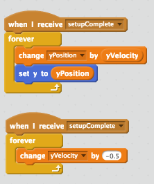

# Octoflap!!!

Today we're going to make our own version of the smash hit game, Flappy Bird. It's pretty simple &mdash; there's a flying object, some obstacles, and gravity.

In this tutorial, you'll learn how to:

* Add gravity to your games and animations
* Figure out when objects are touching ("collision detection")
* Keep score
* Use messages and variables

This tutorial is a little more advanced. If you're new to Scratch, check out [this one](https://github.com/shipstar/tutorials/blob/master/intro_to_scratch/tutorial.md) first.

Let's get flapping!

## Setup

Make the following sprites:

* Something that can flap (I used an octopus)
* The ground
* 2 sets of 2 pipes (one top and one bottom for each set)

Here's what my starting point looks like:

Pro tips:

1. You might need to use Looks > "go to front" on your ground to make it show up in front of the pipes
2. Just make 1 set of pipes, then duplicate them. Much easier!
3. Resize your flappy thing if she's too big. Otherwise, she can't fit through the pipes.

## The Gravity of Gravity

### Starting off on the right foot

Next, let's make our flappy thing have some gravity. We won't worry too much about the pipes yet.

There are 3 concepts we need to learn: position, velocity, and acceleration.

* Position tells us where something is
* Velocity tells us how fast the position is changing
* Acceleration tells us how fast the velocity is changing

For example, if you're driving a car, you might be at 96th and Meridian (position) going 60 miles per hour (velocity). If you used to be going 55 miles per hour, but now you're going 60, then you "accelerated."

Position and velocity will change, but acceleration will stay the same. We use variables to track things that change, so let's create two variables on our flappy thing: yPosition and yVelocity.

Now, when the green flag is clicked, let's set the yPosition to 80 and the yVelocity to 0. We'll also need to "set y to <yPosition>." (Let's also "set x to -180" as a good default.)

Try clicking the green flag. Your flappy thing should move to the correct starting position.

Let's actually add gravity now!

### Falling down

We could start by adding a "when green flag clicked," but if you have multiple "when green flag clicked" entries, you don't know what order they'll run in. That means your flappy thing might start falling before it's done moving to the right place. Instead, let's broadcast an event called "setupComplete" at the end of our current green flag clicked block.

Now, we need to do 2 things every frame:

1. Update our yPosition based on our yVelocity
2. Update our yVelocity based on our constant acceleration

Here's what that looks like:

Try clicking the green flag and see what happens.

Whoops! Did your flappy thing just fall to the ground? Did she even try to flap?

**Challenge: Make her flap**

Make the space bar key keep your flappy thing in the air.

**Hint**: If yVelocity is what's making her fall, what do you think we should change to make her fly?

If you get everything working, you should be able to keep your flappy thing flying for a while:

## Moving forward

If you've played Flappy Bird, you might think that you need to move your flappy thing to the right. Think again! Instead of moving the flappy thing right, we're going to cheat and *move the pipes left*.

I set Pipe 1's starting x position to 0, then made it move 3 pixels to the left every frame. (I set Pipe 2's starting x position to 200 for now.)

Here's what my game looks like now:

As you can see, the pipes just get to the end and stop. Pretty lame! Let's reset them when they get to the end.

**Challenge: Make the pipes reset**

If the pipes reach the left-hand side (hint: xPosition < -250 or so), then set their x to 200.

If you get it working, your pipes should move back to the right when they hit the left side of the screen:

## Pipes are dangerous!

Right now, there's no way to lose. Is it even Flappy Bird if you can't lose every 3 seconds? Let's add that in.

**Challenge: Make pipes and the ground deadly!**

Add blocks to your flappy thing so that if it's touching the ground, pipe 1, or pipe 2, it stops all scripts.

If you're feeling especially courageous, you can add a noise or a game over screen.

Also, if your flappy thing is too big to fit through the pipes, make your flappy thing smaller, the gap between your pipes bigger, or make the yVelocity when you flap smaller.

## Score!

Before we release our Flappy Thing game for everyone to enjoy, let's add scoring in there. For now, the easiest way to keep score is just to add 1 every time a pipe gets to the left side of the screen.

Congratulations! You've made Flappy Bird. Now all of your friends will hate you, because this game is hard!

## Bonus challenges

1. Make your flappy thing rotate so that he's facing up when he flaps and down as he falls.
2. Make the pipes appear at random x and y positions.

If you get stuck, check out [this project](http://scratch.mit.edu/projects/19325129/#player) for inspiration. Try to solve it on your own or ask for help first, though!