# Fortune Cookie Clicker

Are you a cookie clicker fanatic? Do you sometimes have trouble sleeping because you just need ONE MORE COOKIE?! If so, this is the tutorial for you!

In this tutorial, you'll learn how to:

* Handle user input
* Use some simple variables
* Get addicted to clicking things

You can see a final version of the game [here](http://scratch.mit.edu/projects/24844177/).

Let's get started!

## Setup

### Delete the cat

Not much to say here. Sorry kitty!

### Choose a background

Click on the "Stage" on the left-hand side:

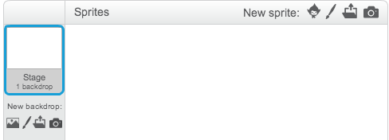

Select the "Backdrops" tab, then click on the "Choose backdrop from library" option:

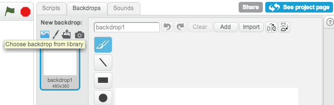

I picked the "rays" option, but you can choose whatever you want.

### Create a fortune cookie sprite

We'll use this to add cookies every time someone clicks on it.

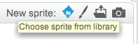

### Add a cookie variable

Under the Scripts -> Data menu, click "Make a variable." Choose "For all sprites" and call it "cookies."

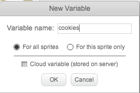

If you got everything set up correctly, you should see something like this:

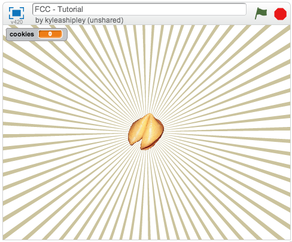

## Clicking the cookie

Now that we're all set up, let's make our game more fun!

Select the fortune cookie sprite. Under the "Events" menu, you should see "when this sprite clicked." Under the "Data" menu, you'll see "change cookies by 1." Put both of those together:

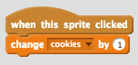

Try clicking your cookie:

It works! See you next month!

Just kidding. There's lots more!

As a bit of housekeeping, let's reset the number of cookies when the player clicks the green flag. Select the "Stage" item, then add the following script:

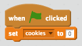

Now whenever you restart the game, the number of cookies will get set back to 0.

Before we move on, let's make clicking the cookie a little more interesting. When the player clicks it, let's make it a little bigger, then a little smaller again:

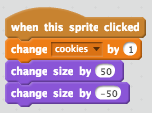

Try clicking your cookie a few times.

That didn't work, did it? That's because your computer is so LIGHTNING FAST that it gets bigger and smaller faster than you can possibly see it. Instead of doing 50 all at once, let's do it in 5 chunks of 10 using the "repeat" block:

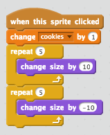

Try clicking it now:

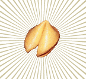

**YEAAAAAAAH!** That's awesome.

Try clicking it really fast:

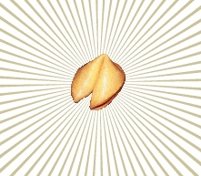

**GRAAHAHAHAHAHAHRRAWHARWL!!!! IT'S GOING TO DESTROY US ALL!**

Luckily, we're awesome, and we can fix it by making sure that the cookie always gets set back to 100% size before we animate it:

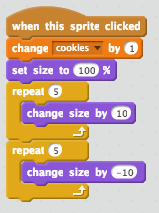

Phew. That was easy!

## Growing your fortune cookie business

Everyone loves your fortune cookies. They're clicking faster than you can make them. It's time to hire your first employee!

### Add an employees variable

Just like we did with cookies, we need to keep track of how many employees we have. Make a new variable called "employees." Remember to reset it to 0 when you click the green flag. (**Hint**: Look under the "stage.")

### Add a "Hire Employee" button

I used the "button2-a" costume for my button. Then I changed the font to "Marker" and added some text that said "Hire Employee":

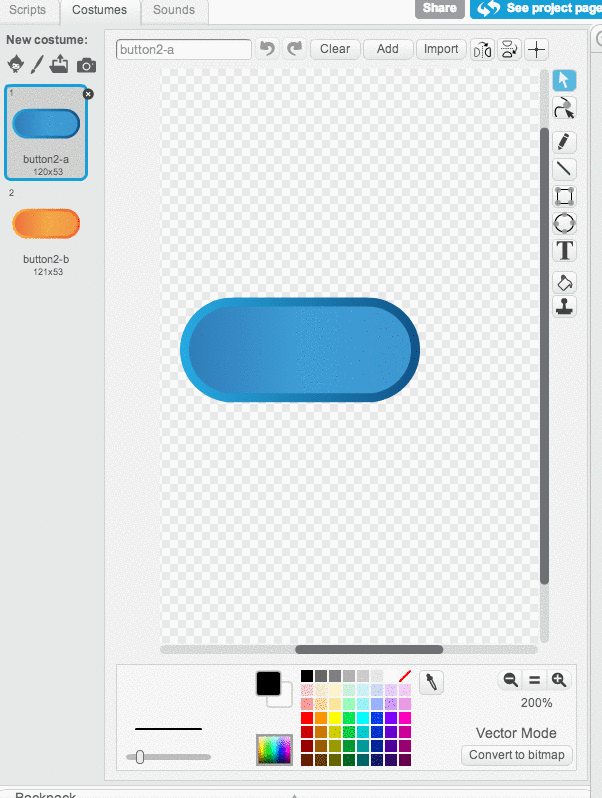

Now we just need to make it add a new employee when you click it:

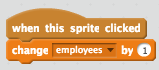

Try hiring a few employees. You should see the number of employees go up.

Those employees aren't making any cookies for you, though. In fact, they're not even showing up for work. What a bunch of lazy bums!

### Add an employee sprite

Let's make sure that our employees are showing up for work. Create a new sprite to represent your employees. I used Giga, but you can use whomever you want. I also made Giga smaller so he would fit a little better:

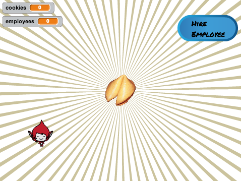

We have a couple problems we need to deal with here:

* Giga shows up even though we have 0 employees right now!
* We have to manually create a new employee sprite every time we add an employee. That's no good!

First things first: let's go ahead and hide our employee when you click the green flag:

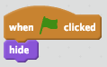

If you click "Hire Employee," you'll notice that no one is showing up to work still. In order to make our employee show up to work, we need to use something called "cloning." You can think of cloning like a cookie cutter. Our employee sprite is the cookie cutter, and now we want to make a bunch of cookies that look just like him.

First, we need our button to tell us that we're ready to create a clone:

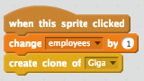

(Remember that your employee sprite might be different. Mine is Giga, but yours could be a bat, a cat, or something wacky.)

Next, in our employee sprite, we need to react to being cloned. Under "Control," drag the "when I started as a clone" block in.

First, let's figure out where to position ourselves. We probably want our clones to spread out across the screen, so we'll have to use a little bit of math based on the number of employees we have. Here's the math &mdash; I'll explain it in a moment:

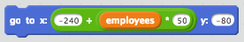

Let's start with the easy part: `y: -80`. If you hover your mouse around the main drawing area, you should see the `x` and `y` values to the lower-right updating. `-80` felt like a good choice.

The `x` value is a little harder. Basically, we're saying that we want to start at `-240`, then place every new employee `50` pixels to the right of the last employee.

(If you need help with the math, ask for help! We can help you draw a picture to understand.)

The last thing we need to do for now is make the clone show up.

Put it together and you should have:

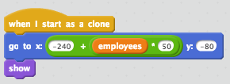

Try clicking on the "Hire employee" button. You should see employees showing up to work now!

### Get to work!

Your employees still aren't making any cookies for you. We want them to make 1 cookie every second forever. In block form, we can say that with:

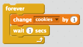

Add that underneath your "show" block.

Click the green flag and try hiring some employees.

They're finally doing the work you hired them for!

It's a little hard to see which ones are actually working, so let's add a subtle animation to make it easier. We'll use a similar trick to the one we used for the cookie. In between "change cookies by 1" and "wait 1 secs," add the following:

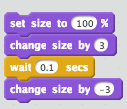

(We could've done the "repeat 5" trick we used before, but it's a little slow when you have lots of employees. This one is a bit simpler.)

Now your employees should animate when they do work!

## Everything has a price

Right now, you're getting free labor. You don't have to spend anything to hire a new employee. That's not fair!

Luckily, in our economy, everyone is paid in cookies. Let's make hiring an employee cost 25 cookies.

First, let's add a "25" to our button so the user knows how much it will cost:

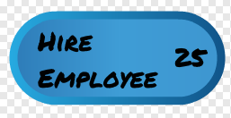

Next, we need to make sure the user actually has 25 cookies before we hire a new employee:

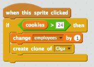

Try clicking the button. Now you can't hire an employee for free anymore. (THANKS OBAMA.)

Finally, let's charge 25 cookies for the employee's salary:

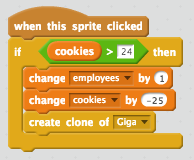

Click your cookie 25 times, then hire an employee. You should lose 25 cookies, but gain an employee. Capitalism yay!

Here's the final version of our game. Now we can get our friends addicted and charge them cookies to play it:

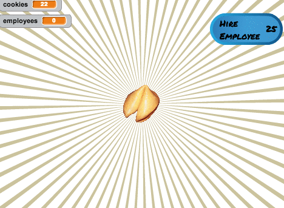

## Challenges

That's all for the main walkthrough, but here's a few more things you can add to make your game more fun:

* Add restaurants (Costs 200, adds 5 cookies / second)
* Add factories (Costs 1000, adds 10 cookies / second)
* Change the background at 500 / 5000 cookies to reward the player