# Intro to Scratch

Scratch is a cool web program that lets you build your own animations, games, quizzes, and more. It's kind of like "Lego for programming," so if you like Legos, you'll like Scratch too!

In this tutorial, you'll learn how to:

* Add a background
* Move the cat with the arrow keys
* Make the cat jump
* Add another animal
* Make the cat say something when he touches the other animal

Let's get started!

## The Basics

Go to [scratch.mit.edu](scratch.mit.edu) to get started. Click the "Create" link to create a new project. You should see something like this:

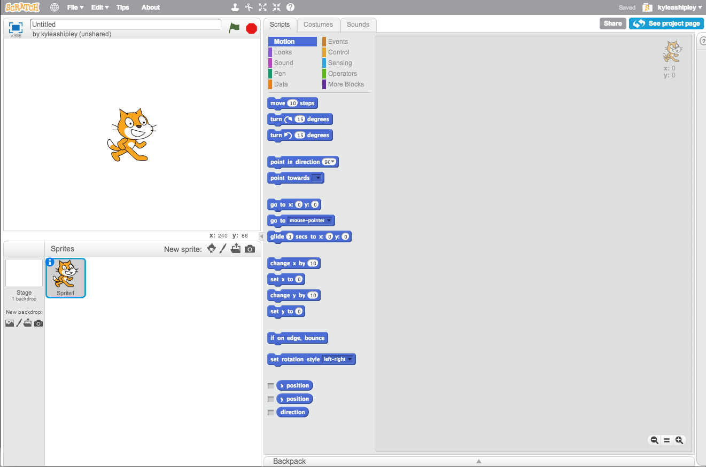

There are 3 main parts to the screen:

In the top-left is the "canvas." That's where all the animals, backgrounds, and animation is going to show up.

The bottom left is where we keep track of our "sprites." Sprite is just a fancy word for part of a picture. It's usually something like a character (the cat) or icon (the mouse cursor).

The right side of the screen is where we're going to do our programming. There are 10 types of programming we can do: Motion, Looks, and so on.

In Scratch, you don't actually need to move a block over to the programming section for it to take effect. If you're just trying something out, just click it and see what happens!

After each section, there will be some challenges for you to tackle. See if you can figure them out on your own first, but don't be afraid to ask for help if you get stuck!

**Challenges:**

1. Drag the cat around to see what happens
2. Make the cat move to the right 3 times (Hint: Use the Motion menu)
2. Rotate the cat by 45 degrees, then rotate him back to normal (Hint: Use the Motion menu)
3. Make the cat meow (Hint: Use the Sound menu)

## Adding A Background

Our cat is a little lonely by himself on a white screen. Luckily, he's an experienced astronaut, so why don't we put him in outer space?

In the lower-left corner next to the cat named Sprite1, you should see a white box called "Stage":

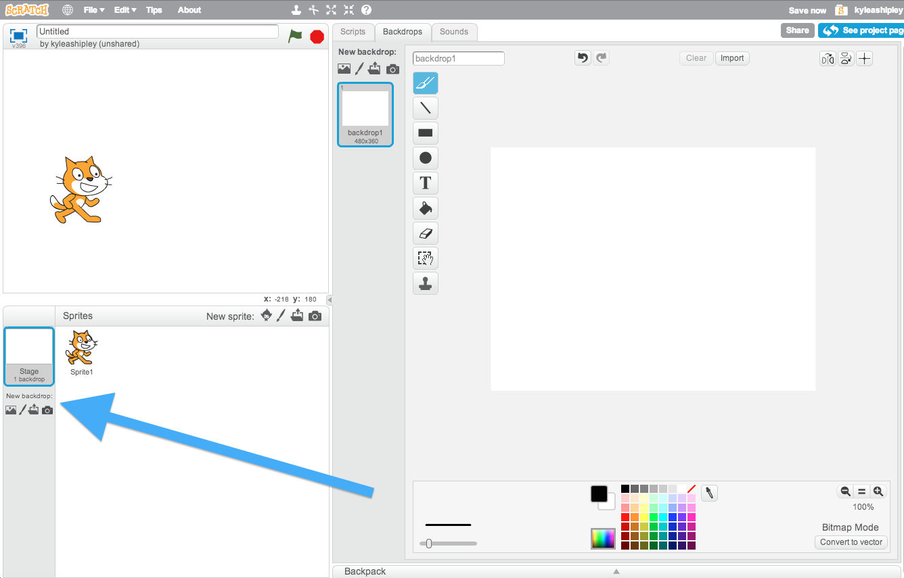

Click the far-left icon &mdash; the one that looks like a painting of a mountain. Select the "Space" theme, select the image called "space," and click "OK" in the bottom-right corner.

Your cat should be in space now!

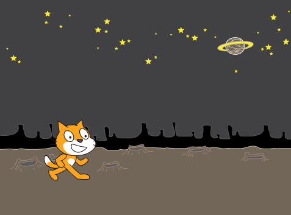

While we're here, let's also give our cat a name. Click on his picture in the sprite panel, then on the little blue (i). I'm going to name mine "Scratchy." Type that in where it says "Sprite1," then click the little blue arrow to go back.

## Moving the Cat

Putting the cat in space was fun, but you're here to program! Even though he's in space, Scratchy needs to exercise, so let's make him move when we push the arrow keys.

First, we need to get back to the programming panel, so click on Sprite1, then select "Scripts" from the tabs at the top of the screen.

Remember when we made the cat move by clicking "move 10 steps" earlier? We want to do the same thing, but make it happen when we press the right arrow key instead.

First, let's go to the Events menu. Events are the way we react to things that happen in our scene. In this case, we want to react to arrow keys. Do you see a block that might help us out?

Yep, it's the "when key pressed" block! Go ahead and drag that over into the programming panel.

We want to make the cat move right, so space bar isn't a very good key to use. Click on the tiny arrow next to the word space and select "right arrow" instead.

Now we need to make the cat actually move. We're going to use the "move 10 steps" block that we used earlier. Drag it over and attach it to the "when key pressed" block. Make sure they snap together!

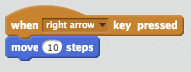

Try pressing the right arrow key. Your cat should move 10 steps to the right!

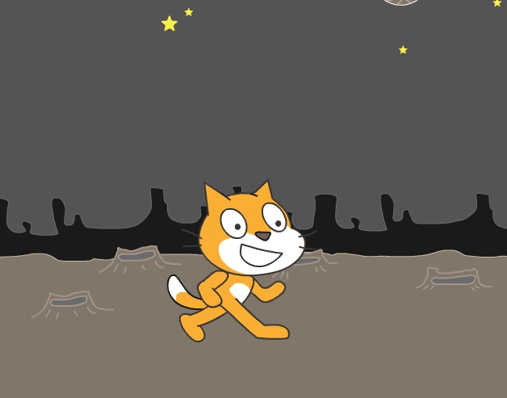

**Challenges:**

1. Try making the cat move left instead of right. (Hint: If you want to end up back where you started, you need to move backwards by the same amount you moved forwards. What number can you add to 10 to get 0?)
2. Is your cat moonwalking? (Good joke because he's on the moon!) I mean, is he walking backwards? Try making him face left when you press left. (Hint: The block you want is under the Motion menu.)
3. Scratchy actually has 2 animation frames. Try making his feet move when he walks. (Hint: Try the "next costume" block under the Looks menu.)

(Is your cat upside-down now? That's no good either! Try using the "set rotation style left-right" block to solve that.)

## Making Scratchy Jump

Now that we've got Scratchy moving left and right, let's make him jump in the air when we press the space bar.

If you've ever used graph paper, you might have heard of the "coordinate plane."

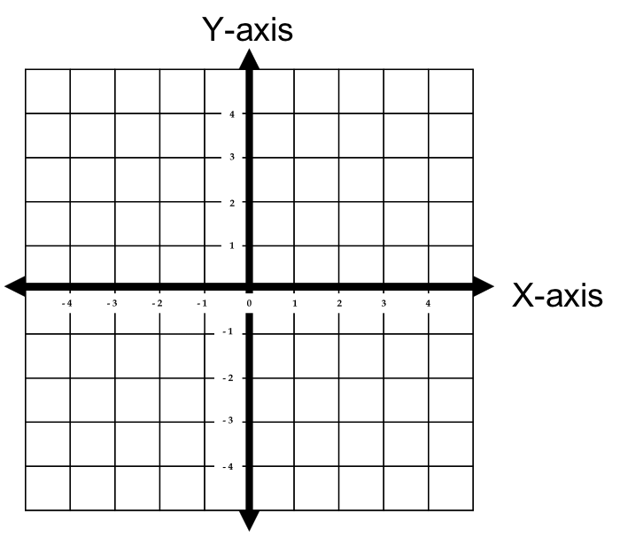

Scratch works the same way too. When we move the cat right, his X position is getting bigger. When he moves left, it's getting smaller. When he moves up, his Y position gets bigger. When he moves down, it gets smaller.

If we want our cat to jump, we need him to move up. That means that his Y position should get bigger.

Let's drag the "when space key pressed" event over. Then, under the Motion menu, you should see a block called "change y by ( )." Let's attach that to the space key event.

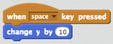

Try pressing the space bar. Your cat is floating off into space! Bye kitty!

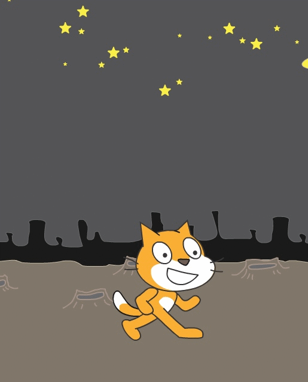

It's not much of a jump if your cat never comes back down. If we increase his Y position by 10, we then need to decrease it by 10 afterwards. Just like with moving left and right, we'll want to change his Y position by -10 at the end of the jump.

Drag another "change y by 10" block underneath the current one, and make it "change y by -10." Press the space bar and your cat will be jumping like a champ!

Or...maybe not? He just kind of sits there. That's boring! You're boring us, cat!

The problem is that Scratch is going to add 10, then subtract 10 faster than you can even tell!

Luckily, there's a block we can add under the Control menu called "wait 1 secs." Drag it in between our two change blocks:

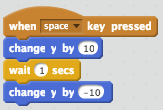

Now press space bar again. The cat jumps just a little bit, waits one second, then comes back down.

He's not exactly Lebron James, is he? Let's make him jump higher. Try changing 10 and -10 to 50 and -50. And while we're there, try change "wait 1 secs" to "wait 0.5 secs." (0.5 is less than 1, so this makes the jump go a little faster.)

Scratchy is jumping a little better now, but it's still kind of a lame animation. In real life you don't just warp around when you jump. To make the animation a little smoother, we'll add something called a loop.

A loop is a way to tell the computer to do something more than once. If you go the Control menu, you should see a block called "repeat 10." Go ahead and move the 3 blocks underneath "when space key pressed" off to the side and drag "repeat 10" in there instead.

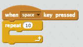

See how there's a spot inside the repeat block for something else? Let's try putting something inside it. Go ahead and drag just the top "change y by 50" inside the repeat block. Press the space bar.

MEOWZA! He went right off the screen. That's because we moved him up by 50 ten times, which means we moved him up by 500 total (10 x 50)!

If we only want him to go up 50 total, we need to move him 50 / 10 each time through the loop, which is 5. Edit your block to be "change y by 5" instead.

Drag your cat back into place, then press the space bar.

That's starting to look more like a jump. We still need to make him come back down, though. Add another "repeat 10" block underneath the current one. Remember how we did +50 and -50 before, and that 50 / 10 is 5. Now we need to do -50 / 10, which is -5. Add a "change y by -5" block into the second repeat loop. You should end up with this:

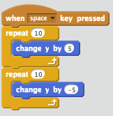

Press space bar as many times as you want to celebrate your accomplishment!

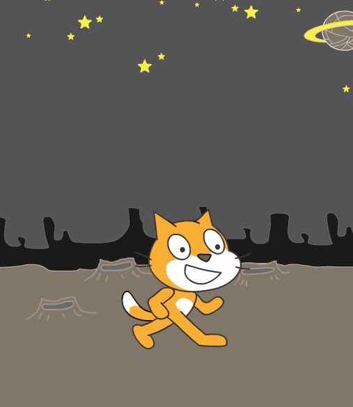

**Challenges:**

1. Make Scratchy do a flip at the top of his jump. (Hint: You'll need to use the repeat block, along with a "turn" block under the motion menu. You'll also need a "set rotation style all around" to let him do his awesome flip.)

## Making Scratchy Talk

Scratchy has been alone for a long time on the moon. He needs someone to hang out with.

Try clicking the little elf head next to "New Sprite" in the lower-left panel:

Because our cat is in space, I'm going to give him an alien friend. I picked Space > Nano, then clicked OK to put him on the moon.

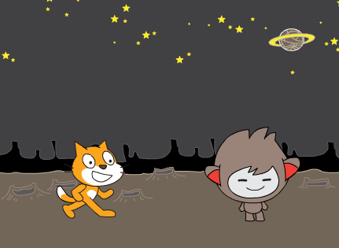

We want to check if Scratchy is touching Nano, then say "Hey buddy!" if they're touching. Let's translate this into programming instructions:

    if <Scratchy is touching Nano> then
        say "Hey buddy!"

(Make sure you click on Scratchy again before you start adding blocks. Otherwise, you might add them to Nano by accident!)

Under the Control menu, you should see a block called "if < > then." Try dragging that into the programming panel.

Next we need to detect when Scratchy is touching Nano. Check the Sensing menu to find something called "touching [ ]." If you click the little arrow, you'll notice that "Nano" is an option. Select Nano, then drag the block into the programming panel.

Notice the weird shape of the "touching" block? It actually fits into the "if < > then" block itself! Drag it up there, and you should have something like:

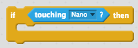

If Scratchy is touching Nano, we want to say, "Hey buddy!" Look under the Looks menu for the "say [ ] for 2 secs" block. (2 seconds is pretty polite. Any longer and it would get weird.) Change the text to "Hey buddy!" then drag it inside the if block.

Try moving Scratchy until he's touching Nano.

Hm. Not a very polite cat. Not yet anyway. But we'll make a gentleman out of him yet!

The problem is that we need to check if they're touching more than once. We want something kind of like repeat, but instead of only running 10 times, it runs forever. Is there a block like that under the Control menu?

How about "forever"? That seems like it would do the trick. Drag it into the programming panel, then put your "if < > then" block inside of it.

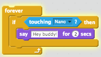

Move Scratchy over to Nano, and...he still isn't saying anything. We could click on the "forever" block to activate it, but we want a way of telling our Scratch program to start running. Under the Events menu, you'll find the "when green flag clicked" block. Go ahead and attach that to the top of your forever block.

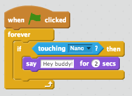

Now, anytime you want to start your animation, just click the green flag. You can put other rules in here like making sure Scratchy and Nano always reset back to their starting locations.

Click the green flag, move Scratchy over to Nano, and watch their friendship bloom!

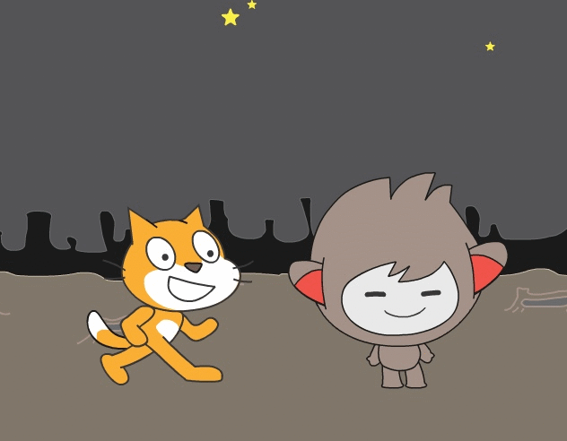

**Challenges:**

1. Make Nano say something back to Scratchy. (Hint: Make sure you click on Nano in the Sprites panel so that you're putting your blocks in the right place.)