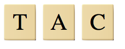
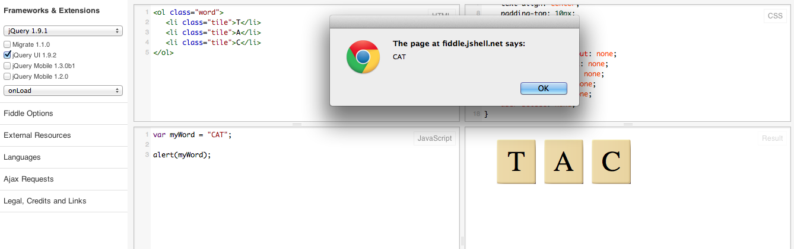
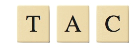
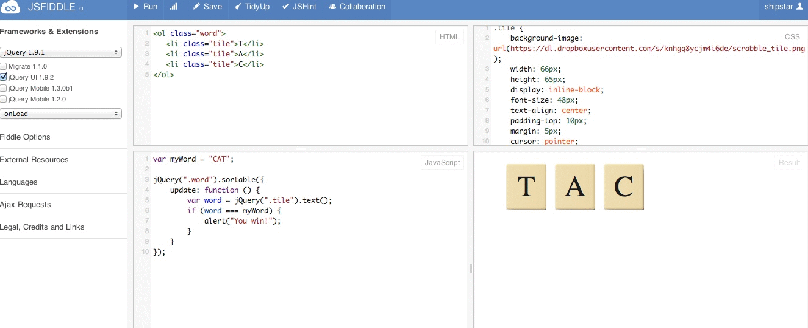

# Word Scramble in JavaScript

If you've been following the Scratch tutorials, this one will be a bit of a change. It's JavaScript time!

Unlike Scratch, where you drag and drop pre-existing blocks, you have to write everything yourself in JavaScript. You'll probably mess up a little bit as you get started &mdash; that's okay! We'll get through it together.

We're going to use a site called [JSFiddle](http://jsfiddle.net/) that lets us write HTML, CSS, and JavaScript all in one window.

In this tutorial, you'll learn how to:

* Write basic JavaScript
* Use libraries called jQuery and jQuery UI that make JavaScript easier
* Make a simple word scramble game

Let's get started!

## Setup

There are 3 main things you need to learn to make web sites and games:

* **HTML** tells the computer what's on the page
* **CSS** tells the computer what things should look like
* **JavaScript** tells the computer how things work

We'll be focusing mostly on JavaScript here.

To get started, go to [JSFiddle](http://jsfiddle.net/) and make sure you have a blank project.

1. In the top left, where it says, "No-Library (pure JS)," select jQuery 1.9.1. Then click "jQuery UI 1.9.2." (We'll need jQuery UI to make moving tiles around easier.)

2. Copy and paste the following CSS into the top right panel:

    ```css
    .tile {
        background-image: url(https://dl.dropboxusercontent.com/s/knhgq8ycjm4i6de/scrabble_tile.png);
        width: 66px;
        height: 65px;
        display: inline-block;
        font-size: 48px;
        text-align: center;
        padding-top: 10px;
        margin: 5px;
        cursor: pointer;
    
        -webkit-touch-callout: none;
        -webkit-user-select: none;
        -khtml-user-select: none;
        -moz-user-select: none;
        -ms-user-select: none;
        user-select: none;
    }
    ```
    
    This will ensure that we have a cool background for our tiles.
    
3. Copy the following HTML structure into the top left panel:

    ```html
    <ol class="word">
        <li class="tile">T</li>
        <li class="tile">A</li>
        <li class="tile">C</li>
    </ol>
    ```
   
   (If you're curious, `ol` stands for "ordered list," and `li` is list item.)
   
Click the "Run" command. You should see something like the following in the bottom right panel:



## Learn us some JavaScript

At this point, the HTML tells us that there's something called word, and word contains 3 tiles: T, A, and C. The CSS says that they should have a cool background so they look like Scrabble tiles. Now, we need JavaScript to tell them what to do.

First things first: let's tell JavaScript what our secret word is. In the lower left panel, enter the following:

```javascript
var myWord = "CAT";
```
    
That's a little different from Scratch. Let's break it down:

* `var myWord` means that we're going to declare a variable called `myWord`. We use a variable because we could change the value later (to "act," for example).
* `=` means that we're storing whatever is on the right in whatever is on the left. In this case, we're storing the word "CAT" inside a variable called "myWord."
* We use `"` (quotation marks) to indicate that we're going to store a "string." A string is basically just a list of letters. It could be a word (`"CAT"`), a sentence (`"MY CAT IS AWESOME."`), or even a whole paragraph (`"MY CAT IS AWESOME. HE SLEEPS IN MY ROOM. HE FIGHTS BEARS WHEN I'M AWAY."`). Strings can be uppercase (`"HELLO"`), lowercase (`"hello"`), or a mixture (`"HeLlO, mY FrIeNd! 12345."`).

Just to prove that it worked, let's add one more line:

```javascript
alert(myWord);
```

If you typed it right, you should see a pop-up box that says "CAT":



If everything worked, remove the `alert(myWord);` line and let's move on.

## Learn us some jQuery

We're going to use jQuery UI's `sortable` function to make our lives easy. You can try a demo [here](https://jqueryui.com/sortable/) or read the [documentation](http://api.jqueryui.com/sortable/) if you're more advanced.

The short version: There's a function called `sortable` that we can call on a list of things. Remember how `ol` is an ordered list? Well, that certainly seems like a list! Let's try calling it.

```javascript
jQuery(".word").sortable();
```

Let's break it down again:

`".word"` means that we're looking for an HTML element with a `class` of `word`. If you look at the top left panel, you should see `<ol class="word">`. That looks like the right one!

`jQuery(".word")` just turns that `ol` into a jQuery element, which gives it some special functions.

Finally, we call `.sortable()`. jQuery UI gives us this function (remember the demo?) that lets us drag around items in a list.

If everything is hooked up correctly, you should be able to drag your letters around:



## Conjunction junction, what's your function?

Next, we need to see if our player has dragged the tiles into the right order. Things are going to get a little crazy here...

The `sortable` function can take a set of options, one of which is called `update`. `update` is also a function, and it gets called when the thing you're dragging is finally dropped into place. Let's start simple and just alert when the letter gets dropped.

```javascript
jQuery(".word").sortable({
    update: function () {
        alert("dropped!");
    }
});
```

Let's break this down again. First, what's a `function`?

A function is a set of actions that can be packaged up and run together. Try adding this to your JavaScript panel:

```javascript
// Declare a function called redAlert
var redAlert = function () {
    alert("RED ALERT!");
};

// Call the redAlert function
redAlert();
```

What if we want to add a `blueAlert`?

```javascript
var blueAlert = function () {
    alert("BLUE ALERT!");
};

blueAlert();
```

What if we want to add alerts for every color? That could be a lot of typing. Instead, notice how the parentheses are empty? Those parentheses tell us what data we can pass to a function. Let's instead make a function called `colorAlert` that can take any color:

```javascript
var colorAlert = function (color) {
    alert(color + " ALERT!");
}

colorAlert("RED");
colorAlert("BLUE");
```

Now we're cooking!

## Winning the game

Instead of `alert("dropped!");`, let's print out the current order of the letters on the screen. We can use jQuery here again:

```javascript
jQuery(".word").sortable({
    update: function () {
        var word = jQuery(".tile").text();
        alert(word);
    }
});
```

Try dragging tiles around. What prints out? It should be the order of the tiles on the screen.

The final step -- instead of alerting every time tiles are dragged, let's only tell the player if they've won. To do that, we'll need to use an `if` statement. (Remember those?) We want to check if the user's word is the same as our word. Here's the final code:

```javascript
var myWord = "CAT";

jQuery(".word").sortable({
    update: function () {
        var word = jQuery(".tile").text();
        if (word === myWord) {
            alert("You win!");
        }
    }
});
```

First, we get the user's word. Then, using `===` (is equal to), we check to see if the two words are the same. If they're the same, we tell the player they've won.

Try playing the game. You should be able to win now:



## Part 2

I hope this was a fun introduction to JavaScript! In the next tutorial (coming soon), you'll make the game more interesting by adding multiple words, automatically scrambling them, and starting a new game once they win.

You can see a sneak peak of the more complex game [here](http://jsfiddle.net/shipstar/AWq2t/).
